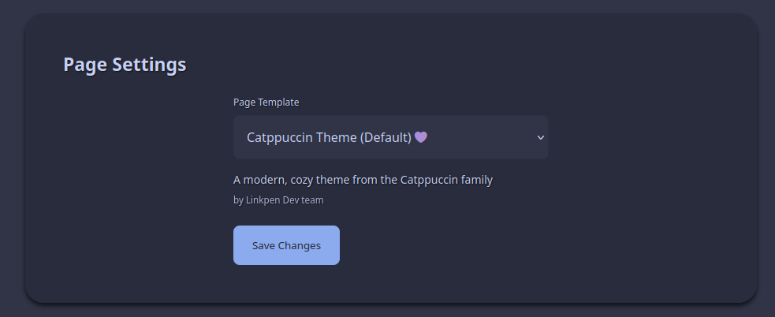

# Templates (Themes) Guide
A simple(ish) in-depth(ish) guide to creating Template Themes for linkpen!

## Getting Started
To begin, make sure you have cloned the repository. This guide assumes you have already done so.

Create a new folder in `/public/templates`. Name it something in line with your theme name, but make sure you use no spaces.
Example: `dark mocha` folder name becomes `dark_mocha` or `dark-mocha` (we prefer snake case, though).

Inside this folder you need an `index.ejs` file, for your themes layout, and a `style.css` file for your CSS styling.

Your folder should have the following layout:
```
my-template/
├── template.ejs
└── style.css
```

## Indexing Theme
After you've created your template's folder, you will need to modify the `config` file at `public/templates/config.json` to refister it.

```json
{
    "default": {
        "name": "Catppuccin Frappé (Default)",
        "author": "Linkpen Dev team",
        "description": "😸 Soothing pastel theme for the high-spirited!"
    },
    "your_theme": {
        "name": "yourTheme",
        "author": "You :)",
        "description": "Wow, a description."
    }
}
```
*replace `your_theme` with your **template's folder name** and fill in the details according to your theme.

_Image for reference, using the Default template shown above:_



## Quick Links

- [GitHub Repository](https://github.com/sleepingami/linkpen)
- [Live Demo](https://linkpen.xyz/) - [Mirror](https://demo.demo.linkpen.xyz)
- [Discord Community](https://discord.gg/pbV2eFEHBt)
- [Report an Issue](https://github.com/sleepingami/linkpen/issues)
- [Return to index](./index.md)
